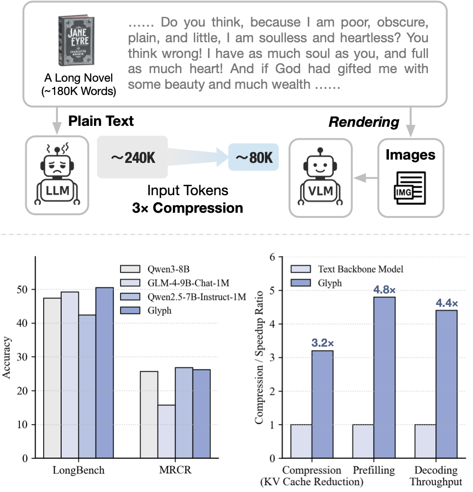
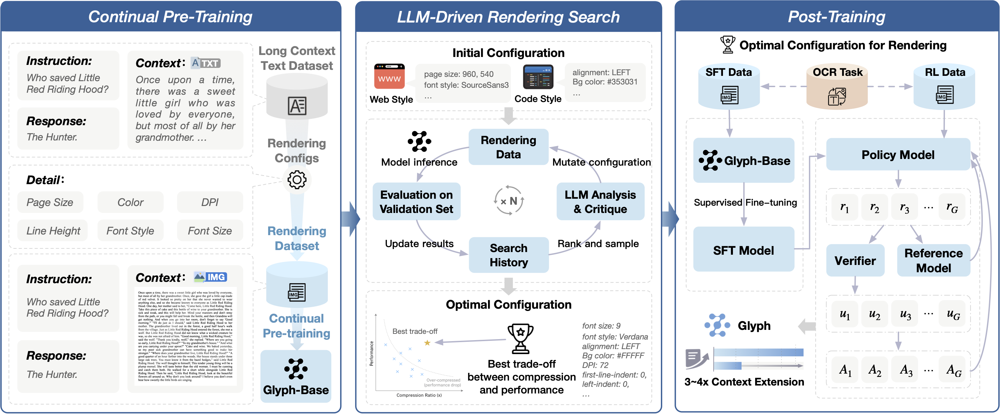
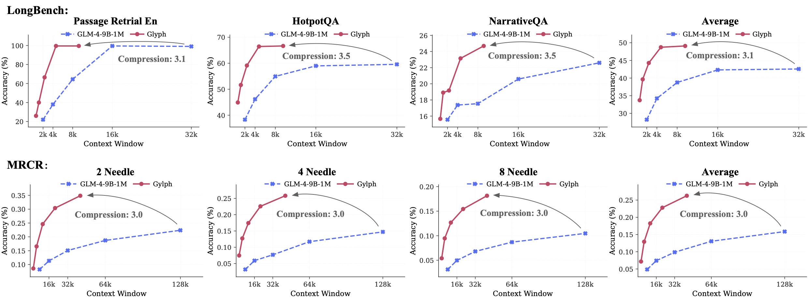
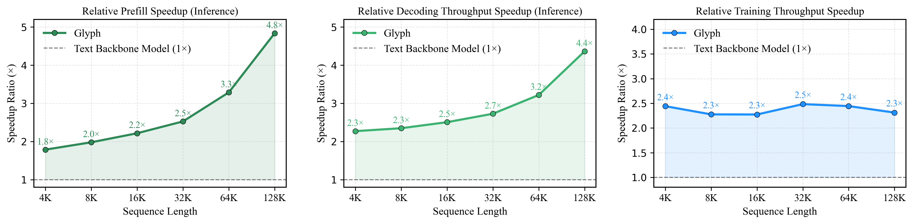
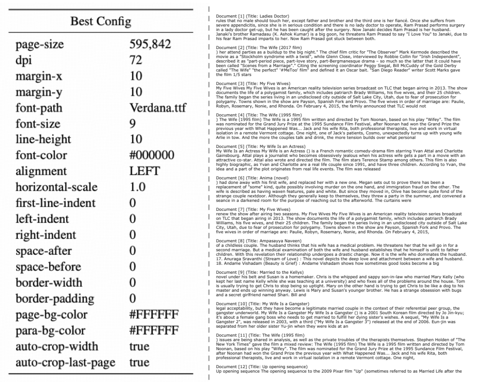

<hr>

<h2>
<p align="center">
  <a href="">Glyph: Scaling Context Windows via Visual-Text Compression</a>
</p>
</h2>


<p align="center">
  <a href=""><b>🤗 Model Download</b></a> |
  <a href="https://arxiv.org/pdf/2510.17800"><b>📄 Paper Link</b></a> 
</p>

(Upper) Comparison of paradigms for long-context tasks: conventional text-based LLMs vs. the proposed Glyph, a VLM approach that renders text as compact images for efficient token compression. (Lower) Glyph achieves competitive results on LongBench and MRCR, with notable compression and inference speedups on 128K-token inputs.
<div align="center">


  <a href="assets/intro.pdf" target="_blank">
    
  </a>
</div>


## Release
- [2025/10/21] 🚀🚀🚀 We release the **Glyph** paper — introducing a framework for **visual–text compression** that renders long texts into compact images and processes them with vision–language models (VLMs).

- [Coming Soon] 📦 Our code and model will be open-sourced shortly. Stay tuned!


## Framework 



Glyph consists of three main stages: continual pre-training on rendered long-text data, LLM-driven genetic search for optimal rendering configurations, and post-training with SFT, RL. Together, these stages enable efficient long-context modeling with visual-text compression.


## Result
###  Visual-Text Compression.


Glyph achieves **context window scaling**, matching the performance of text LLMs that use 3×–3.5× longer contexts through **visual–text compression**.

### Speedup ratios of Glyph


Speedup ratios of Glyph over the text backbone model for prefill, decoding, and training across different sequence lengths.

## Rendering Config
<div align="center">

</div>


<!-- ## Citation
```

``` -->
